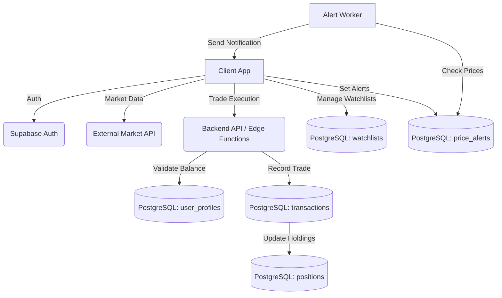

# Trading Platform Architecture Plan

## Overview
This document outlines the architecture for a comprehensive trading platform featuring paper trading, watchlists, price alerts, portfolio tracking, and social features. The system is designed to be scalable, secure, and modular, leveraging Supabase for backend services, PostgreSQL for relational data, and Row Level Security (RLS) for data isolation.

## 1. Paper Trading Engine
- **Objective:** Allow users to simulate trading without risking real capital.
- **Architecture:**
  - **User Profiles:** Extended to include a `paper_balance` (starting at a default value, e.g., $100,000).
  - **Portfolios:** Users can have multiple portfolios, categorized by `type` (e.g., 'paper', 'real').
  - **Transactions:** All simulated trades are recorded in the `transactions` table linked to a 'paper' portfolio.
  - **Positions:** Aggregated holdings are tracked in the `positions` table, updated via database triggers or backend services upon successful transaction execution.

## 2. Watchlists & Alerts
- **Watchlists:** Users can create multiple custom watchlists. The `watchlists` table stores the list metadata, while `watchlist_items` maps assets to specific watchlists.
- **Price Alerts:** The `price_alerts` table stores user-defined thresholds (e.g., "Alert me when AAPL goes above $150"). A background worker or edge function will periodically check real-time market data against active alerts and trigger notifications (push/email).

## 3. Portfolio Tracking
- **Structure:** Hierarchical tracking where a User owns Portfolios, Portfolios contain Positions, and Positions are modified by Transactions.
- **Performance Metrics:** Real-time portfolio value and historical performance will be calculated by joining `positions` with real-time market data feeds.

## 4. Social Features & Learn-to-Earn
- **Social:** Users can share their paper trading performance, watchlists, or specific trades. (Future expansion: `social_posts`, `comments`, `followers` tables).
- **Educational Progress:** The `educational_progress` table tracks user completion of learning modules. Completing modules can reward users with increased paper trading balances or unlock platform features.

## 5. Security & Data Isolation
- **Authentication:** Supabase Auth handles user identity.
- **Authorization:** PostgreSQL Row Level Security (RLS) ensures users can only access their own portfolios, transactions, watchlists, and alerts.
- **Data Integrity:** Foreign key constraints and database triggers ensure consistency between transactions, positions, and user balances.

## 6. Data Flow Diagram

